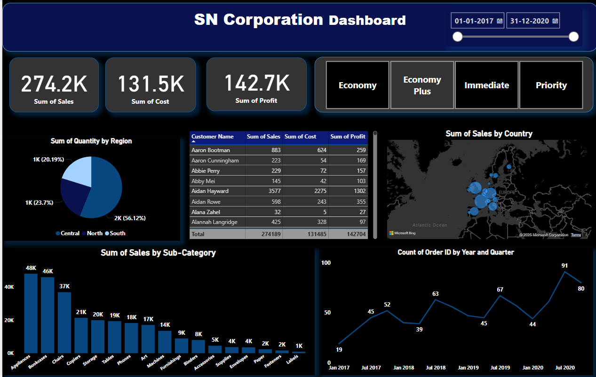

# SN Corporation Power BI Dashboard

This dashboard project was created during a **Power BI Workshop led by *Jatan Shah* in **14th & 15th December, 2024**.

In **June 2025**, I updated the visual styling — including background color and layout improvements — to enhance clarity and presentation.

  

---

## 📊 Dashboard Highlights

- ✅ **Total Sales, Cost, and Profit KPIs**
- 🌍 **Sales by Country** – interactive map view
- 📦 **Sales by Sub-Category** – bar chart insights
- 🧭 **Quantity by Region** – pie chart distribution
- 📅 **Order Trends Over Time** – line chart by year & quarter
- 👤 **Customer-wise Summary Table**

---

## 🧰 Tools Used

- Power BI Desktop
- Data Modeling
- Custom Visual Styling (2025 update)

---

## 🔗 Credits

- **Workshop Instructor:** Jatan Shah
- **Workshop Date:**  14th & 15th December, 2024

---

Feel free to explore, fork, or share feedback!

